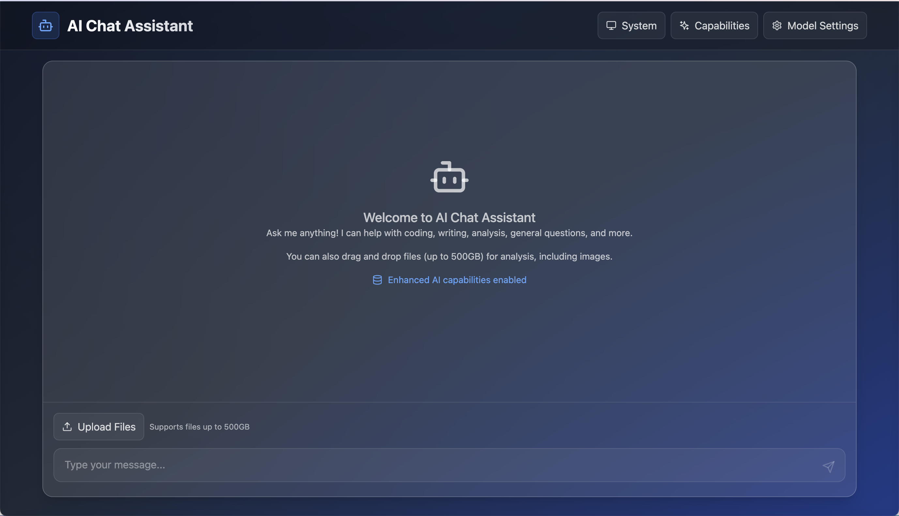
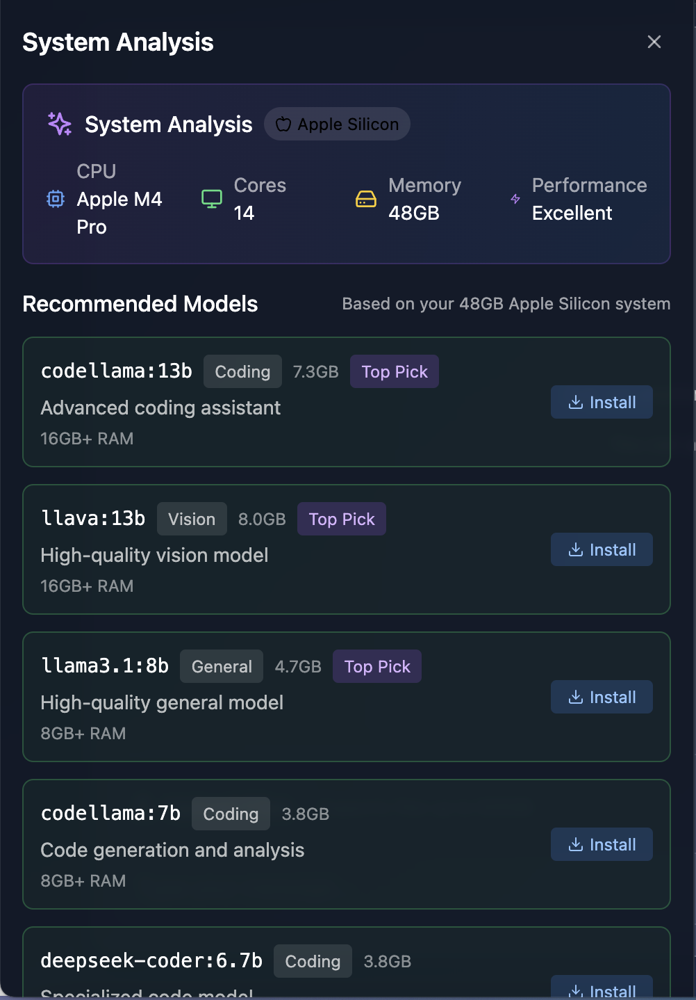
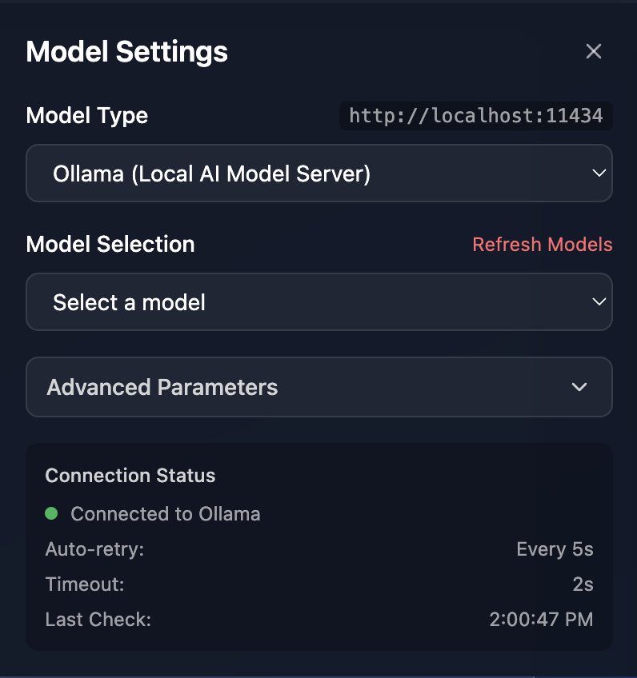
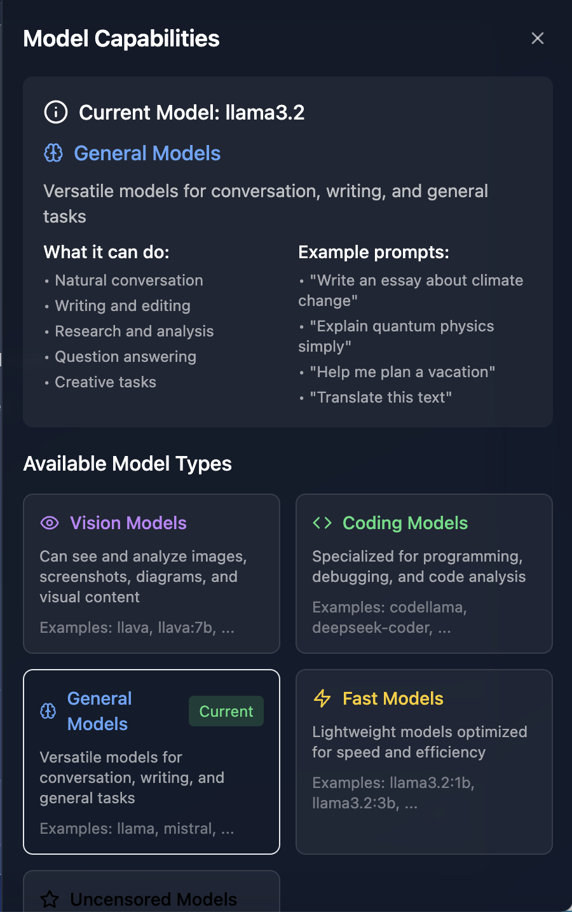

# 🤖 AI Chat Assistant

**A super simple AI chat app that runs on your computer!** ✨

No complicated setup, no monthly fees, no data sent to the cloud. Just you, your computer, and powerful AI models running locally.


*The beautiful main chat interface - clean, simple, and powerful*

## 🎯 What Does This Do?

Think of this as your personal ChatGPT that:
- 🏠 **Runs entirely on YOUR computer** (private & secure)
- 🧠 **Analyzes your system** and recommends the best AI models
- 👁️ **Can see and understand images** you upload
- 💻 **Helps with coding, writing, questions** - anything!
- 📁 **Handles huge files** (up to 500GB!)
- ⚡ **Works great on Apple Silicon Macs** (M1, M2, M3, M4)


*Smart system detection - it knows your hardware and suggests the perfect models*

## 🚀 Super Easy Setup (10 Minutes!)

### Step 1: Get the Basic Tools (5 minutes)

1. **Install Node.js** (if you don't have it):
   - Go to [nodejs.org](https://nodejs.org) 
   - Download the green "LTS" version
   - Install it (just click through the installer)

2. **Install Ollama** (the AI brain):
   - Go to [ollama.ai](https://ollama.ai)
   - Click "Download" for your system
   - Install it (drag to Applications on Mac, run installer on Windows)

### Step 2: Get This App (2 minutes)

1. **Download this app**:
   ```bash
   git clone https://github.com/hellogreencow/chat.git
   cd chat
   npm install
   ```
   
   *Don't know how to use terminal? No problem!*
   - **Mac**: Press `Cmd + Space`, type "terminal", press Enter
   - **Windows**: Press `Win + R`, type "cmd", press Enter
   - **Then copy-paste the commands above one by one**

### Step 3: Start Everything (3 minutes)

1. **Start the AI server**:
   ```bash
   ollama serve
   ```
   *(Keep this window open - it's your AI brain running)*

2. **In a NEW terminal window**, start the app:
   ```bash
   npm run dev
   ```

3. **Open your browser** and go to: `http://127.0.0.1:5556`

**🎉 That's it! You now have your own AI assistant!**


*Easy model management - the app connects to Ollama automatically*

## 🤖 Getting Your First AI Model

The app will guide you, but here's the super simple version:

1. **Click the "System" button** in the top right
2. **See what the app recommends** for your computer
3. **Click "Install"** on any model you like

Or manually install a model:
```bash
ollama pull llama3.2:8b
```

**Confused about which model to choose?** Here's the simple guide:

- 🏃‍♂️ **Fast & Light**: `llama3.2:3b` (great for quick questions)
- 🎯 **Best Balance**: `llama3.2:8b` (perfect for most people)
- 👁️ **Can See Images**: `llava:7b` (upload photos and ask about them!)
- 💻 **Coding Helper**: `codellama:7b` (writes and explains code)


*Different AI models for different tasks - the app explains everything*

## 🎨 Cool Things You Can Do

### 📸 Upload Images and Ask Questions
- Drag any photo into the chat
- Ask "What's in this image?"
- Get detailed descriptions, identify objects, read text in images

### 💻 Get Coding Help
- Ask it to write code in any language
- Debug your programs
- Explain complex code concepts

### 📝 Writing Assistant
- Write emails, essays, stories
- Fix grammar and improve writing
- Translate between languages

### 🧠 General Knowledge
- Ask about history, science, current events
- Get explanations for complex topics
- Research assistance

### 📁 Analyze Documents
- Upload text files, PDFs (up to 500GB!)
- Summarize long documents
- Extract key information

## 🔧 Troubleshooting (If Something Goes Wrong)

**"The app won't start"**
- Make sure Node.js is installed: type `node --version` in terminal
- Make sure you're in the right folder: `cd chat`

**"No models available"**
- Make sure Ollama is running: `ollama serve`
- Try installing a model: `ollama pull llama3.2:3b`

**"Can't connect to Ollama"**
- Check if Ollama is running: look for it in your system tray
- Restart Ollama if needed

**"Images won't upload"**
- Make sure you have a vision model like `llava:7b`
- The app will warn you if your current model can't see images

## 🍎 Special Notes for Mac Users

If you have an Apple Silicon Mac (M1, M2, M3, M4), you're in luck! This app:
- 🔍 **Automatically detects your chip**
- ⚡ **Runs models super efficiently**
- 🧠 **Recommends models optimized for your Mac**
- 💾 **Takes advantage of unified memory**

The system analyzer will show your exact chip and recommend the best models for your setup.

## 🎯 What Makes This Special?

- **🔒 100% Private**: Your conversations never leave your computer
- **💰 Free Forever**: No subscriptions, no API keys, no limits
- **🚀 Fast**: Runs locally, no internet required for chatting
- **🎨 Beautiful**: Modern, clean interface that's joy to use
- **🧠 Smart**: Automatically optimizes for your hardware
- **👁️ Multimodal**: Text, images, documents - it handles everything

## 📚 Want to Learn More?

- **Ollama Models**: [ollama.ai/library](https://ollama.ai/library)
- **Ask Questions**: Open an issue on GitHub
- **Contribute**: Pull requests welcome!

---

**Made with ❤️ for everyone who wants powerful AI without the complexity**

*No PhD in computer science required! 🎓*